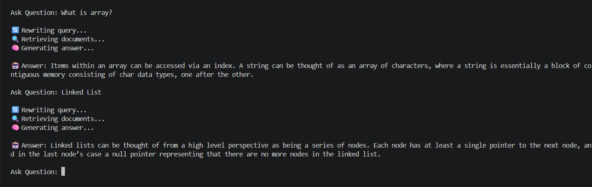
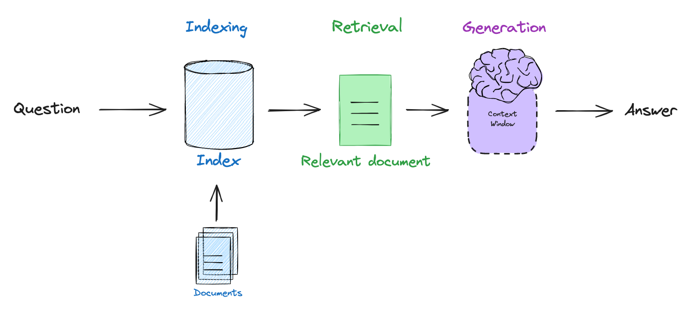

## 🤖📃 DocMind AI

DocMind AI is a Retrieval-Augmented Generation (RAG) chatbot that allows users to ask questions directly from PDF documents.

Instead of manually searching through hundreds of pages, users can simply ask questions in natural language and receive accurate, context-aware answers generated using AI.

The project combines Information Retrieval and Generative AI to create a smarter way of interacting with documents.

---

## 📸 Demo

### 💬 Chat Interface


---

### 🔍 Asking Questions from a PDF

Users can ask questions in natural language and receive answers grounded in the uploaded document.



---

### 🧠 Retrieval-Augmented Generation (RAG)

The chatbot retrieves the most relevant information from the document before generating a response, helping reduce hallucinations and improve accuracy.



---

## 📖 What is DocMind AI?

DocMind AI is a Generative AI-powered document assistant built using Gemini, Pinecone, and LangChain.

The system processes PDF documents, converts them into vector embeddings, stores them in a vector database, and retrieves relevant information whenever a user asks a question.

The retrieved context is then passed to Gemini, which generates a response based on the document content.

This allows users to interact with documents conversationally instead of manually searching through pages of text.

## 🎯 Why I Built It

While learning Generative AI, I became curious about how applications like ChatGPT can answer questions using custom documents and knowledge bases.

Most beginner AI projects focus on prompting an LLM, but I wanted to understand what happens behind the scenes when an AI system works with private or domain-specific data.

To explore these concepts practically, I built DocMind AI, a Retrieval-Augmented Generation (RAG) chatbot capable of answering questions directly from PDF documents.

Through this project, I wanted to learn:

- How embeddings represent text as vectors
- How vector databases store and retrieve knowledge
- How semantic search finds relevant information
- How Retrieval-Augmented Generation (RAG) works
- How LLMs use retrieved context to generate accurate answers

Building this project helped me move beyond simply using AI models and understand the architecture behind modern AI applications.

## ✨ Features

- 📄 **PDF Document Ingestion**
  Load and process PDF documents to create a searchable knowledge base.

- ✂️ **Intelligent Text Chunking**
  Splits large documents into smaller chunks for efficient retrieval and better context management.

- 🧠 **Gemini Embeddings**
  Converts text into high-dimensional vector embeddings for semantic understanding.

- 📦 **Pinecone Vector Database**
  Stores embeddings and enables fast similarity-based retrieval.

- 🔍 **Semantic Search**
  Retrieves information based on meaning rather than exact keyword matching.

- 🔄 **Query Rewriting**
  Automatically converts follow-up questions into standalone queries to improve retrieval accuracy.

- 💬 **Context-Aware Conversations**
  Maintains chat history to support multi-turn interactions.

- 🤖 **AI-Powered Answer Generation**
  Uses Gemini 2.5 Flash to generate answers grounded in retrieved document context.

- 🛡️ **Hallucination Reduction**
  Responses are generated using retrieved knowledge instead of relying solely on the model's training data.

- ⚡ **Rate Limit & Retry Handling**
  Implements retry mechanisms with exponential backoff for improved reliability.

- 🏗️ **Modular Architecture**
  Separates ingestion, retrieval, embeddings, query transformation, and generation into independent components.

## 🧠 How It Works

DocMind AI follows a Retrieval-Augmented Generation (RAG) pipeline to transform PDF documents into a conversational knowledge base.

### 🔄 Flow Overview

```text
PDF Document
      ↓
PDF Loader
      ↓
Text Chunking
      ↓
Gemini Embeddings
      ↓
Pinecone Vector Database

User Question
      ↓
Query Rewriting
      ↓
Semantic Retrieval
      ↓
Relevant Context
      ↓
Gemini 2.5 Flash
      ↓
Generated Answer
```

---

### ⚙️ Step-by-Step Breakdown

#### 1. 📄 PDF Processing

The system loads a PDF document and extracts its textual content.

---

#### 2. ✂️ Text Chunking

The extracted text is divided into smaller chunks.

This improves retrieval accuracy and helps the model work within context limits.

---

#### 3. 🧠 Embedding Generation

Each chunk is converted into vector embeddings using Gemini Embeddings.

These embeddings capture the semantic meaning of the text rather than simple keywords.

---

#### 4. 📦 Vector Storage

The generated embeddings are stored in Pinecone, a vector database optimized for similarity search.

---

#### 5. 💬 User Question

A user asks a question in natural language through the chatbot interface.

---

#### 6. 🔄 Query Rewriting

If the question depends on previous conversation history, the system rewrites it into a complete standalone query.

Example:

```text
User: What is a Binary Search Tree?

User: What are its advantages?
```

Becomes:

```text
What are the advantages of a Binary Search Tree?
```

This improves retrieval quality for follow-up questions.

---

#### 7. 🔍 Semantic Retrieval

The rewritten query is converted into an embedding and compared against stored document vectors.

The most relevant chunks are retrieved from Pinecone.

---

#### 8. 🤖 Answer Generation

The retrieved context is provided to Gemini 2.5 Flash.

The model generates a response using the retrieved information instead of relying solely on its pre-trained knowledge.

---

#### 9. ✅ Response Delivery

The final answer is returned to the user along with the conversation history for future interactions.

---

### 🧩 Key Design Principles

- **Retrieval Before Generation**
  Relevant document context is retrieved before generating a response.

- **Context-Aware Conversations**
  Follow-up questions are supported through query rewriting and chat history.

- **Reduced Hallucinations**
  Answers are grounded in retrieved document content.

- **Modular Architecture**
  Embedding, retrieval, query transformation, and generation are separated into independent services.

## 🛠️ Tech Stack

### ⚙️ Backend

- Node.js
- JavaScript (ES Modules)

---

### 🤖 AI & LLM

- Gemini 2.5 Flash
- Gemini Embeddings

---

### 🧠 RAG Components

- LangChain
- Pinecone Vector Database

---

### 📄 Document Processing

- PDF Loader
- Recursive Text Splitting

---

### 🔧 Utilities & Tools

- dotenv
- readline-sync

---

### 🏗️ Core Concepts Implemented

- Retrieval-Augmented Generation (RAG)
- Semantic Search
- Vector Embeddings
- Similarity Search
- Query Rewriting
- Context-Aware Conversations
- Prompt Engineering
- Conversation Memory

## 📁 Project Structure

```text
DocMind-AI/
│
├── src/
│   │
│   ├── config/
│   │   └── pinecone.js          # Pinecone connection setup
│   │
│   ├── services/
│   │   ├── chat.js              # Gemini answer generation
│   │   ├── embedder.js          # Creates vector embeddings
│   │   ├── queryTransformer.js  # Rewrites follow-up questions
│   │   └── retriever.js         # Retrieves relevant document chunks
│   │
│   ├── utils/
│   │   └── splitter.js          # Document chunking utility
│   │
│   ├── ingest.js               # PDF ingestion pipeline
│   └── index.js                # Chatbot entry point
│
├── data/
│   └── dsa.pdf                 # Source document
│
├── .env                        # Environment variables
├── .gitignore
├── package.json
├── package-lock.json
└── README.md
```

---

### 🧩 Folder Overview

#### 📂 config

Contains configuration files and external service connections.

- `pinecone.js` → Initializes and exports the Pinecone client.

---

#### 📂 services

Contains the core business logic of the application.

- `embedder.js` → Generates embeddings using Gemini.
- `retriever.js` → Performs semantic search in Pinecone.
- `queryTransformer.js` → Converts follow-up questions into standalone queries.
- `chat.js` → Generates final answers using Gemini.

---

#### 📂 utils

Contains reusable utility functions.

- `splitter.js` → Splits large documents into manageable chunks.

---

#### 📄 ingest.js

Responsible for the ingestion pipeline:

1. Loads PDF documents
2. Splits text into chunks
3. Generates embeddings
4. Stores vectors in Pinecone

---

#### 📄 index.js

Main application entry point.

Handles:

- User interaction
- Query transformation
- Retrieval workflow
- Response generation
- Conversation history

```

```

## ⚙️ Installation & Setup

Follow these steps to run DocMind AI locally.

### 1️⃣ Clone the Repository

```bash
git clone https://github.com/your-username/docmind-ai.git

cd docmind-ai
```

---

### 2️⃣ Install Dependencies

```bash
npm install
```

---

### 3️⃣ Configure Environment Variables

Create a `.env` file in the project root and add the following:

```env
GEMINI_API_KEY=your_gemini_api_key

PINECONE_API_KEY=your_pinecone_api_key
PINECONE_INDEX_NAME=your_pinecone_index_name
```

---

### 4️⃣ Create a Pinecone Index

Create a new index in Pinecone and configure:

```text
Dimensions: 3072

Metric: Cosine Similarity
```

> Ensure the index name matches the value specified in your `.env` file.

---

### 5️⃣ Add a PDF Document

Place your PDF file inside the `data` directory.

Example:

```text
data/
└── dsa.pdf
```

---

### 6️⃣ Run the Ingestion Pipeline

Generate embeddings and store them in Pinecone:

```bash
npm run ingest
```

This process:

- Loads the PDF
- Splits the text into chunks
- Generates embeddings using Gemini
- Stores vectors in Pinecone

---

### 7️⃣ Start the Chatbot

```bash
npm run dev
```

You should see:

```text
🤖 RAG Chatbot Started

Type 'exit' to stop.
```

---

### ✅ You're Ready!

Now you can start asking questions about your document:

```text
Ask Question:
What is a Binary Search Tree?

🤖 Answer:
A Binary Search Tree is...
```

## 🚀 Usage

After indexing a PDF and starting the chatbot, users can ask questions in natural language about the document.

### Example

```text id="pl9r9z"
Ask Question:
What is a Binary Search Tree?

🤖 Answer:
A Binary Search Tree is a hierarchical data structure...
```

### Sample Questions

- What is a Binary Search Tree?
- Explain linked lists.
- What are the advantages of queues?
- Compare stacks and queues.
- What is tree traversal?

DocMind AI retrieves relevant information from the document and generates context-aware answers using Gemini.

## 🚀 Future Improvements

- [ ] Support multiple PDF documents
- [ ] Web-based chat interface
- [ ] Source citations for generated answers
- [ ] Conversation persistence
- [ ] Hybrid search (Keyword + Vector Search)
- [ ] Metadata filtering
- [ ] Multi-user document collections

---

## 👨‍💻 Author

**Krishna Singh Chauhan**

Passionate about AI, Backend Development, and Cybersecurity.

- GitHub: https://github.com/Krishna5601-Cpu
- LinkedIn: www.linkedin.com/in/krishna-chauhan-275690389


---

⭐ If you found this project interesting, consider giving it a star.

